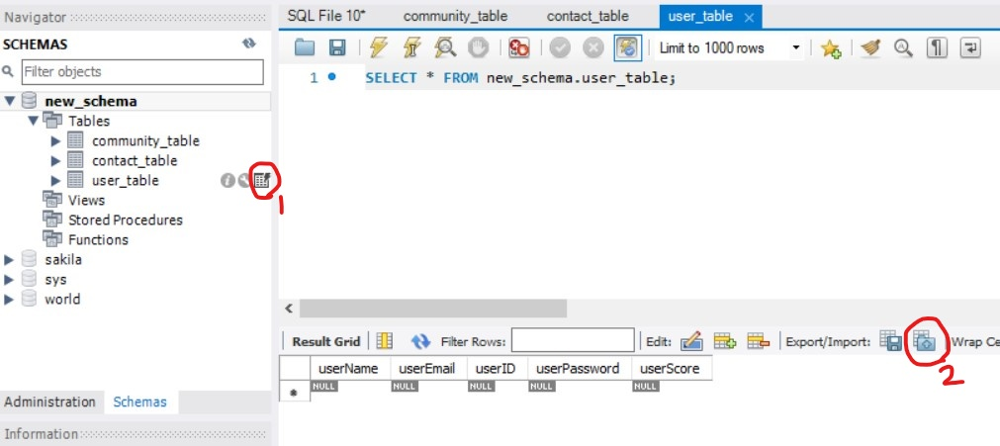

# 2017312262_CHA_JEONG_MIN_final_project
Web Programming Lab_SWE3048_41 final project

I used Tomcat, MySQL, and Eclipse, and all the default settings(server, classpath, and etc..) are same with the lecture video.

Before start installation, **the MySQL Connection user name and password should be 'root'.**

## Installation

1. Go eclipse File > New > Dynamic Web Project.

2. Create any project name.

3. Back to the project folder, and copy the 'src' folder to the New Project.

4. src > webapp > `MainPage.jsp` right click > Run As > Run on Server.

5. Choose Tomcat server > Finish.

6. Go MySQL and Login the connection > Copy the 'DB_generator.txt' (in the project folder) to the query. Or copy the code below > Click Run.

CREATE SCHEMA `new_schema` ;

CREATE TABLE `new_schema`.`user_table` (

  `userName` VARCHAR(20) NOT NULL,
  
  `userEmail` VARCHAR(20) NOT NULL,
  
  `userID` VARCHAR(20) NOT NULL,
  
  `userPassword` VARCHAR(20) NOT NULL,
  
  `userScore` INT NOT NULL,
  
  PRIMARY KEY (`userID`));
  
CREATE TABLE `new_schema`.`community_table` (

  `ID` INT NOT NULL,
  
  `Title` VARCHAR(45) NOT NULL,
  
  `userID` VARCHAR(20) NOT NULL,
  
  `userName` VARCHAR(20) NOT NULL,
  
  `Date` DATETIME NOT NULL,
  
  `Content` VARCHAR(2048) NOT NULL,
  
  `Available` INT NOT NULL,
  
  PRIMARY KEY (`ID`));
  
CREATE TABLE `new_schema`.`contact_table` (

  `contactName` VARCHAR(20) NOT NULL,
  
  `contactInfo` VARCHAR(20) NOT NULL,
  
  `contactMessage` VARCHAR(100) NOT NULL);
 

7. Double click `new_schema` > click 1 > 2.

8. Browse > select `community_table.csv` > Open.

9. Use existing table > select `new_schema.community_table` > Just Next > ... > Finish.

10. Same with 8~9, but choose **user_table**
