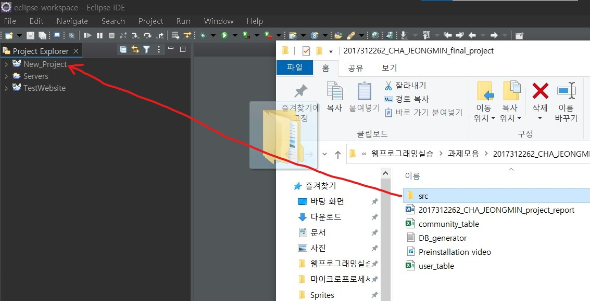
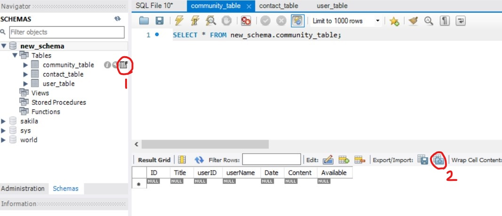

# 2017312262_CHA_JEONG_MIN_final_project
Web Programming Lab_SWE3048_41 final project

I used Tomcat, MySQL, and Eclipse, and all the default settings(server, classpath, and etc..) are same with the lecture video. 

Before start installation, the MySQL Connection user name and password should be 'root'.

